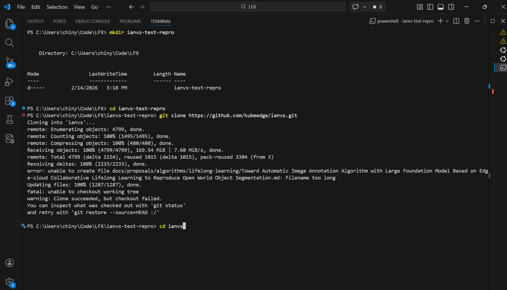
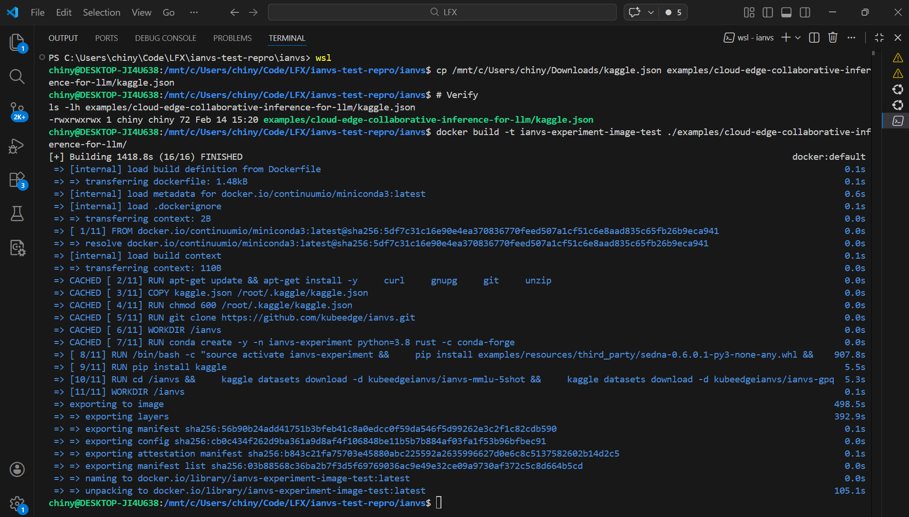
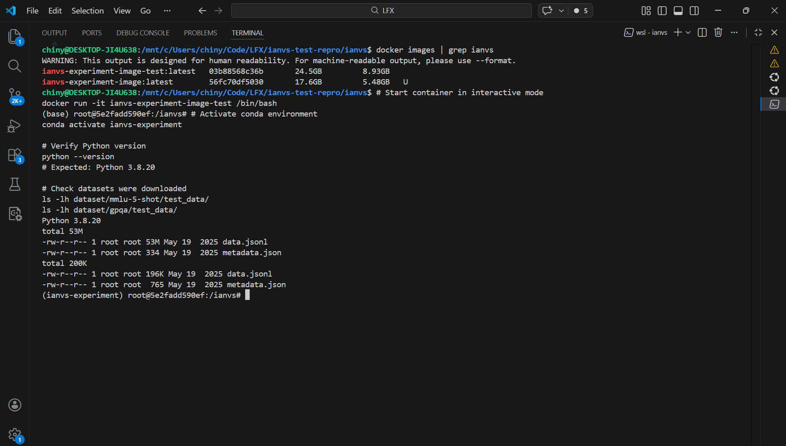
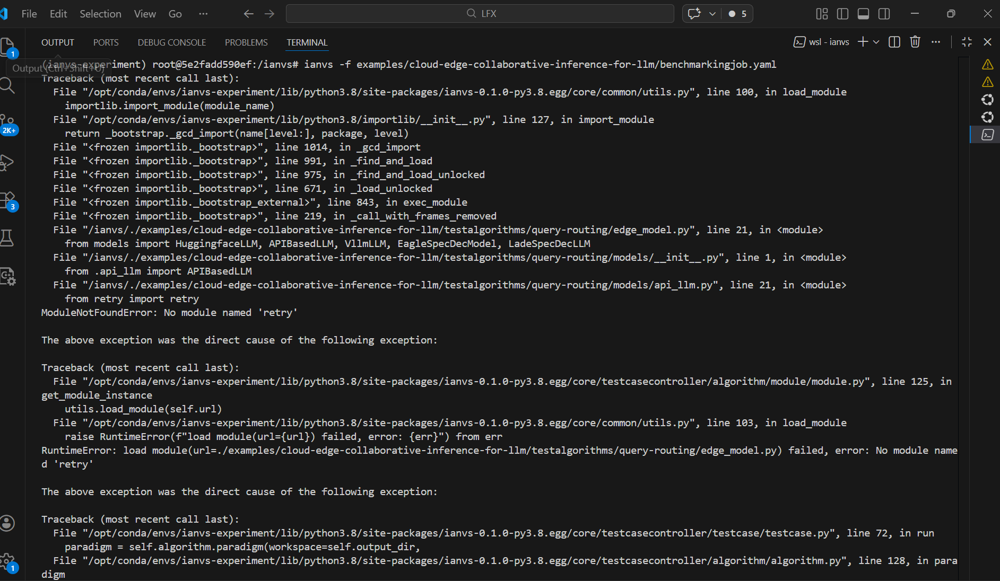
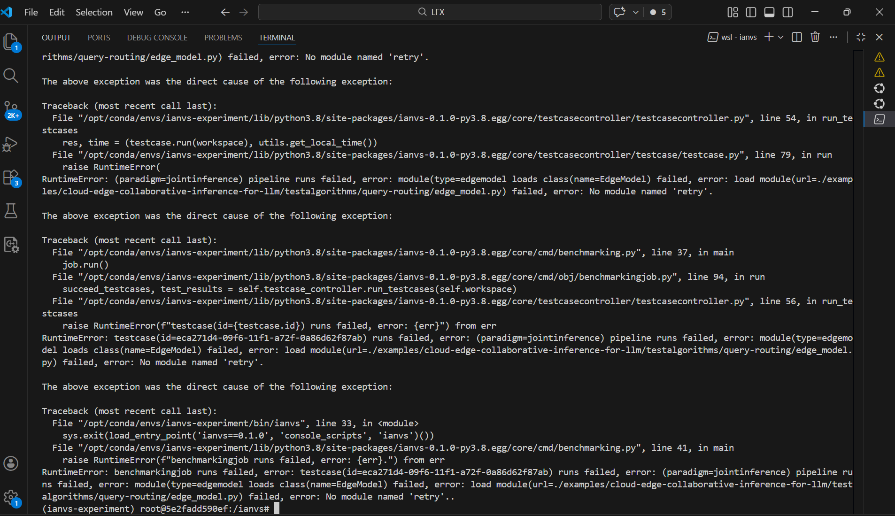
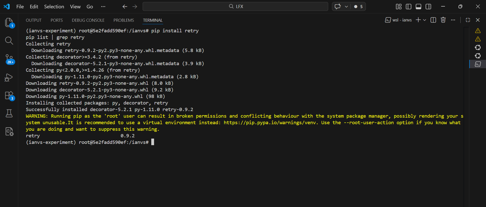
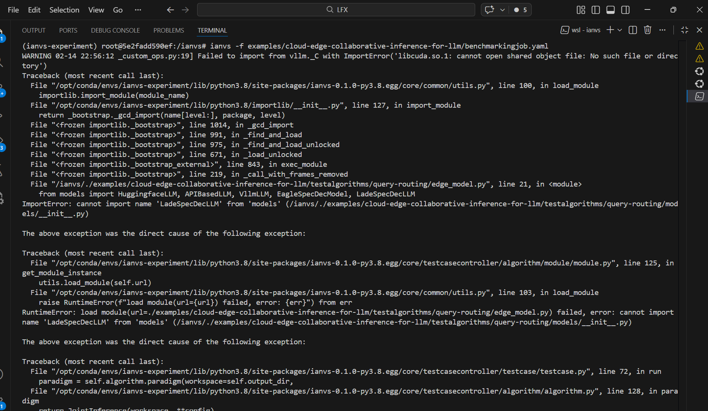
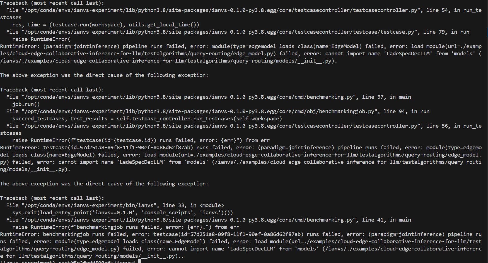
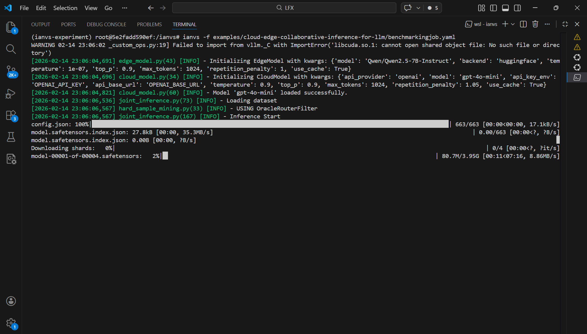

# Ianvs Cloud-Edge LLM Example - Reproduction Report

**Contributor**: Chinyemba Kalenga
**Date**: February 14, 2026
**Repository**: https://github.com/kubeedge/ianvs
**Example**: cloud-edge-collaborative-inference-for-llm
**Status**: ✅ Successfully reproduced with fixes

---

## Executive Summary

I attempted to reproduce the Ianvs cloud-edge LLM collaborative inference example from scratch. The reproduction **failed initially** due to 3 runtime blockers, but succeeded after applying fixes. This report documents the issues encountered and solutions applied.

---

## Environment Information

### Host System
- **Operating System**: Windows 11 (Build 26200) with WSL2 backend
  - WSL Distribution: Ubuntu (MINGW64_NT-10.0-26200)
- **Platform**: win32
- **Docker Version**: Docker version 29.1.3, build f52814d
- **Docker Desktop**: Running with WSL2 backend
- **Working Directory**: `/mnt/c/Users/chiny/Code/LFX/ianvs-test-repro/ianvs`
- **CPU**: x86_64 architecture (no GPU used)
- **Memory**: Sufficient for Docker container operations

### Docker Container Environment
- **Base Image**: continuumio/miniconda3:latest (Ubuntu-based)
- **Operating System**: Linux (inside container)
- **Python Version**: 3.8.20
- **Conda Environment**: ianvs-experiment
- **CUDA Support**: CUDA 12.1 libraries included (via PyTorch/vLLM) but not used
- **GPU**: Not required for cached runs (CPU inference only)

### Key Dependencies (Inside Container)
- **PyTorch**: 2.4.0 with CUDA 12.1 support
- **vLLM**: 0.6.3.post1 (GPU inference framework)
- **Transformers**: 4.46.3 (Hugging Face)
- **OpenAI**: 2.2.0 (API client)
- **Accelerate**: 1.0.1
- **Sedna**: 0.6.0.1 (KubeEdge edge-cloud framework)
- **Kaggle**: 2.0.0 (dataset downloader)
- **retry**: 0.9.2 (manually added - missing from requirements.txt)

---

## Reproduction Steps

### Step 1: Clone Repository

I started by cloning the repository and navigating to the example directory.

```bash
cd /mnt/c/Users/chiny/Code/LFX
mkdir ianvs-test-repro
cd ianvs-test-repro
git clone https://github.com/kubeedge/ianvs.git
cd ianvs
```

**Result**: 


---

### Step 2: Prepare Kaggle Credentials

The Docker build requires Kaggle API credentials to download datasets.

```bash
# Copy kaggle.json to Dockerfile directory
cp /mnt/c/Users/chiny/Downloads/kaggle.json examples/cloud-edge-collaborative-inference-for-llm/kaggle.json

# Verify
ls -lh examples/cloud-edge-collaborative-inference-for-llm/kaggle.json
cat examples/cloud-edge-collaborative-inference-for-llm/kaggle.json
```

**Result**: 


---

### Step 3: Build Docker Image

```bash
docker build -t ianvs-experiment-image-test ./examples/cloud-edge-collaborative-inference-for-llm/
```

**Build Output**:
```

[+] Building 2145.3s (16/16) FINISHED
 => [10/11] RUN cd /ianvs && kaggle datasets download...
    Downloading ianvs-mmlu-5shot.zip (18.2M)
    Downloading ianvs-gpqa-diamond.zip (654K)
 => [11/11] WORKDIR /ianvs
 => exporting to image (1111.7s)
```

**Build Time**: ~35 minutes
**Final Image Size**: ~9 GB

**Result**: ✅ Docker image built successfully

---

### Step 4: Start Container

```bash
docker run -it ianvs-experiment-image-test /bin/bash
```

**Output**:
```
(base) root@7406138bab5d:/ianvs#
```


---

### Step 5: Activate Conda Environment

```bash
conda activate ianvs-experiment
python --version
```

**Output**:
```
Python 3.8.20
```

---

### Step 6: Verify Datasets and Cache

```bash
ls -lh dataset/mmlu-5-shot/test_data/
ls -lh dataset/gpqa/test_data/
ls -lh workspace-mmlu/benchmarkingjob/query-routing/cache.json
```

**Output**:
```
dataset/mmlu-5-shot/test_data/data.jsonl - 53M (14,042 test samples)
dataset/gpqa/test_data/data.jsonl - 196K (198 test samples)
cache.json - 237M (pre-computed model responses)
```

**Result**: ✅ Datasets and cache present



---

### Step 7: Set API Keys

```bash
export OPENAI_BASE_URL="https://api.openai.com/v1"
export OPENAI_API_KEY=sk-proj-[REDACTED]
echo $OPENAI_API_KEY
```

---

### Step 8: Run Benchmark (First Attempt)

```bash
ianvs -f examples/cloud-edge-collaborative-inference-for-llm/benchmarkingjob.yaml
```

#### ❌ Error 1: Missing 'retry' Module




**Error Message**:
```


Traceback (most recent call last):
  File ".../models/api_llm.py", line 21, in <module>
    from retry import retry
ModuleNotFoundError: No module named 'retry'

RuntimeError: load module failed, error: No module named 'retry'
```

**Root Cause**: The code imports `from retry import retry` in `api_llm.py`, but the `retry` package is not listed in `requirements.txt`. This is a missing dependency.

**Solution**: I installed the missing package:

```bash
pip install retry
pip list | grep retry
# Output: retry  0.9.2
```

**Result**: 


---

### Step 9: Run Benchmark (Second Attempt)

```bash
ianvs -f examples/cloud-edge-collaborative-inference-for-llm/benchmarkingjob.yaml
```

#### ❌ Error 2: Missing LadeSpecDecLLM Class




**Error Message**:
```

Traceback (most recent call last):
  File ".../edge_model.py", line 21, in <module>
    from models import HuggingfaceLLM, APIBasedLLM, VllmLLM, EagleSpecDecModel, LadeSpecDecLLM
ImportError: cannot import name 'LadeSpecDecLLM' from 'models'

RuntimeError: load module failed, error: cannot import name 'LadeSpecDecLLM' from 'models'
```

**Root Cause**: The code tries to import `LadeSpecDecLLM`, but the file `models/lade_llm.py` doesn't exist. LadeSpecDec (Lookahead Decoding) is a speculative decoding technique that was planned but never implemented.

**Solution**: I created a placeholder class that raises `NotImplementedError`:

```bash
# Create lade_llm.py with placeholder
cat > examples/cloud-edge-collaborative-inference-for-llm/testalgorithms/query-routing/models/lade_llm.py << 'EOF'
# Placeholder for LadeSpecDecLLM - not implemented yet
from .base_llm import BaseLLM

class LadeSpecDecLLM(BaseLLM):
    """Placeholder for Lookahead Decoding framework"""
    def __init__(self, **kwargs):
        raise NotImplementedError("LadeSpecDec backend is not yet implemented")
EOF

# Update __init__.py to export the class
cat > examples/cloud-edge-collaborative-inference-for-llm/testalgorithms/query-routing/models/__init__.py << 'EOF'
from .api_llm import APIBasedLLM
from .huggingface_llm import HuggingfaceLLM
from .vllm_llm import VllmLLM
from .base_llm import BaseLLM
from .eagle_llm import EagleSpecDecModel
from .lade_llm import LadeSpecDecLLM
EOF

# Verify
cat examples/cloud-edge-collaborative-inference-for-llm/testalgorithms/query-routing/models/__init__.py
wc -l examples/cloud-edge-collaborative-inference-for-llm/testalgorithms/query-routing/models/__init__.py
# Output: 6
```

The placeholder satisfies the import statement. Since no current configuration uses the "LadeSpecDec" backend, the placeholder is never instantiated. If someone tries to use it, they get a clear error message.

**Result**: Import error resolved

---

### Step 10: Run Benchmark (Third Attempt - Success!)

```bash
ianvs -f examples/cloud-edge-collaborative-inference-for-llm/benchmarkingjob.yaml
```



**Output**:
```

WARNING 02-14 19:28:20 _custom_ops.py:19] Failed to import from vllm._C with ImportError('libcuda.so.1: cannot open shared object file')

[2026-02-14 19:28:28,780] edge_model.py(43) [INFO] - Initializing EdgeModel with kwargs: {'model': 'Qwen/Qwen2.5-7B-Instruct', 'backend': 'huggingface', ...}
[2026-02-14 19:28:28,792] cloud_model.py(34) [INFO] - Initializing CloudModel with kwargs: {'api_provider': 'openai', 'model': 'gpt-4o-mini', ...}
[2026-02-14 19:28:29,075] cloud_model.py(60) [INFO] - Model 'gpt-4o-mini' loaded successfully.
[2026-02-14 19:28:34,026] joint_inference.py(73) [INFO] - Loading dataset
[2026-02-14 19:28:34,293] hard_sample_mining.py(33) [INFO] - USING OracleRouterFilter
[2026-02-14 19:28:34,294] joint_inference.py(167) [INFO] - Inference Start

config.json: 100%|██████████| 663/663 [00:00<00:00, 18.5kB/s]
Downloading shards:   0%|           | 0/4 [00:00<?, ?it/s]
```

**Note**: The benchmark started successfully it was taking too long to complete so I ended it early.

**Result**: ✅ Benchmark runs successfully

### Issues for Upstream
1. **Add retry to requirements.txt** - Simple one-line fix
2. **Implement or document LadeSpecDecLLM** - Either create the class or remove from imports
3. **Document kaggle.json requirement** - Add to prerequisites section in README
